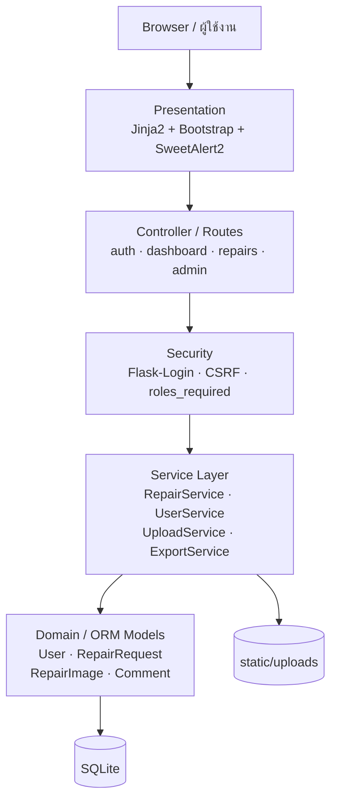
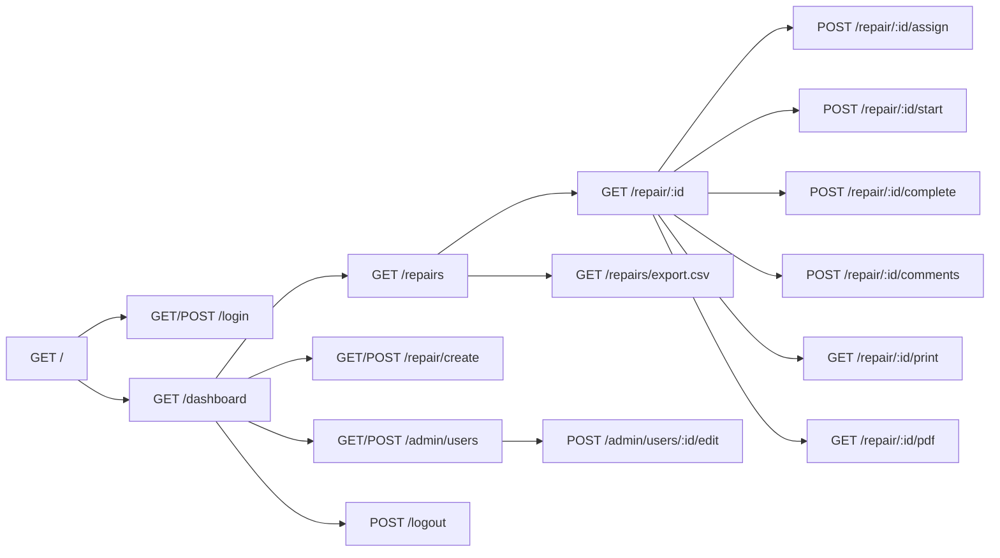
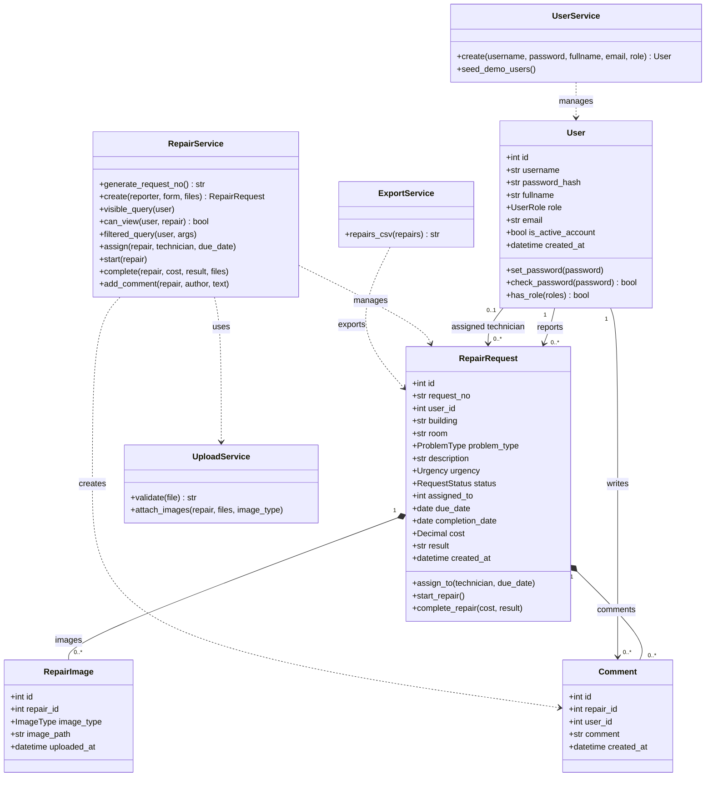
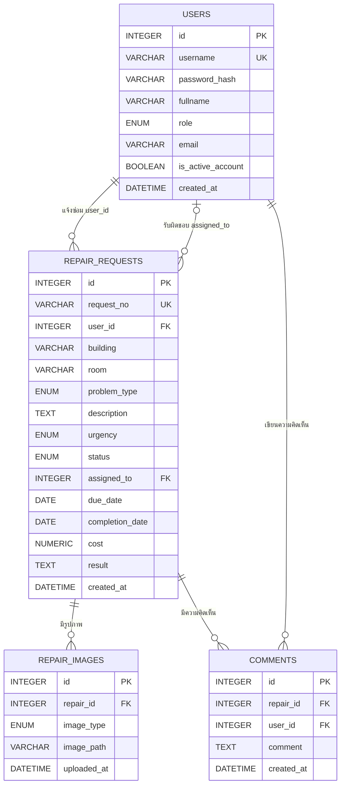
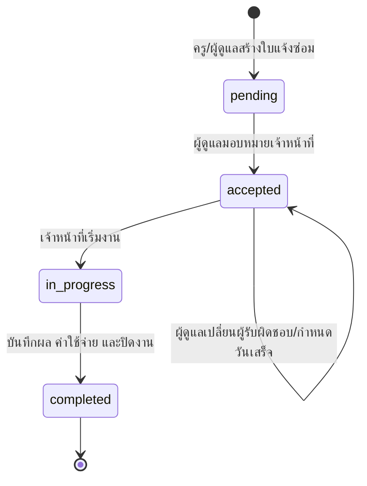

# School Repair Management System

ระบบเว็บสำหรับแจ้งซ่อม มอบหมายงาน ติดตามสถานะ และบันทึกผลการซ่อมภายในโรงเรียน พัฒนาด้วย Flask และออกแบบตามแนวคิด OOAD/OOP โดยใช้ภาษาไทยเป็นภาษาหลักของส่วนติดต่อผู้ใช้

## สารบัญ

- [ความสามารถของระบบ](#ความสามารถของระบบ)
- [ผู้ใช้งานและสิทธิ์](#ผู้ใช้งานและสิทธิ์)
- [สถาปัตยกรรมระบบ](#สถาปัตยกรรมระบบ)
- [Route Diagram](#route-diagram)
- [Class Diagram](#class-diagram)
- [ER Diagram](#er-diagram)
- [Use Case Diagram](#use-case-diagram)
- [Repair Workflow](#repair-workflow)
- [โครงสร้างโปรเจกต์](#โครงสร้างโปรเจกต์)
- [การติดตั้งและเริ่มใช้งาน](#การติดตั้งและเริ่มใช้งาน)
- [บัญชีทดลอง](#บัญชีทดลอง)
- [การทดสอบ](#การทดสอบ)
- [ข้อจำกัด](#ข้อจำกัด)

## ความสามารถของระบบ

- เข้าสู่ระบบและออกจากระบบด้วย Flask-Login
- เก็บรหัสผ่านแบบ hash และป้องกัน CSRF
- ควบคุมสิทธิ์ฝั่งเซิร์ฟเวอร์ตามบทบาท Admin, Teacher และ Technician
- แดชบอร์ดแสดงสถิติตามขอบเขตข้อมูลของผู้ใช้แต่ละบทบาท
- สร้างเลขที่ใบแจ้งซ่อมอัตโนมัติในรูปแบบ `RP-YYYYMM-XXX`
- ค้นหาและกรองตามสถานะ ความเร่งด่วน ประเภทปัญหา เจ้าหน้าที่ และวันที่
- มอบหมายเจ้าหน้าที่ซ่อมและกำหนดวันเสร็จ
- ควบคุม workflow: `pending → accepted → in_progress → completed`
- อัปโหลดรูปก่อนและหลังซ่อมด้วยชื่อไฟล์ UUID พร้อมตรวจ extension, MIME, file signature และขนาด
- บันทึกความคิดเห็น ผลการซ่อม ค่าใช้จ่าย และวันซ่อมเสร็จ
- ส่งออก CSV พร้อมหน้าพิมพ์ A4 และ PDF เมื่อระบบรองรับ WeasyPrint
- จัดการผู้ใช้ เปลี่ยนบทบาท ตั้งรหัสผ่านใหม่ และปิดใช้งานบัญชี
- UI ภาษาไทย พร้อม mapping ส่วนกลางสำหรับสถานะ ความเร่งด่วน ประเภทปัญหา บทบาท และวันที่

## ผู้ใช้งานและสิทธิ์

| บทบาท | ขอบเขตข้อมูล | ความสามารถหลัก |
|---|---|---|
| ผู้ดูแลระบบ (`admin`) | ใบแจ้งซ่อมทั้งหมด | ดูภาพรวม มอบหมายงาน กำหนดวันเสร็จ จัดการผู้ใช้ ส่งออก CSV และพิมพ์รายงาน |
| ครู/บุคลากร (`teacher`) | ใบแจ้งซ่อมที่ตนเองสร้าง | สร้างใบแจ้งซ่อม อัปโหลดรูปก่อนซ่อม ติดตามสถานะ แสดงความคิดเห็น และดูผลการซ่อม |
| เจ้าหน้าที่ซ่อม (`technician`) | งานที่ได้รับมอบหมาย | เริ่มงาน แสดงความคิดเห็น บันทึกผล ค่าใช้จ่าย รูปหลังซ่อม และปิดงาน |

สิทธิ์ถูกตรวจสอบที่ route ด้วย `@login_required`, `@roles_required(...)` และการตรวจสอบเจ้าของข้อมูลใน `RepairService.can_view()` ไม่ได้อาศัยเพียงการซ่อนปุ่มในหน้าเว็บ

## สถาปัตยกรรมระบบ

ระบบใช้ Application Factory ใน `create_app()` และแบ่งความรับผิดชอบเป็นชั้นดังนี้



หน้าที่ของแต่ละชั้น:

- `routes/` รับ HTTP request ตรวจ authentication/authorization และเลือก template หรือ response
- `services/` รวม use case และ business operation เพื่อลด logic ซ้ำใน route
- `models/` กำหนดข้อมูล ความสัมพันธ์ และพฤติกรรมของ domain object
- `enums/` กำหนดค่าภายในที่ระบบอนุญาต
- `localization.py` แปลงค่าภายในเป็นข้อความภาษาไทยโดยไม่เปลี่ยนข้อมูลในฐานข้อมูล
- `templates/` และ `static/` รับผิดชอบ UI ฝั่งเซิร์ฟเวอร์และ JavaScript

## Route Diagram



### รายละเอียด Routes

| Method | Route | สิทธิ์ | การทำงาน |
|---|---|---|---|
| `GET` | `/` | ทุกคน | ส่งผู้ใช้ไปหน้าเข้าสู่ระบบหรือแดชบอร์ด |
| `GET, POST` | `/login` | ผู้ที่ยังไม่เข้าสู่ระบบ | แสดงฟอร์มและตรวจสอบชื่อผู้ใช้/รหัสผ่าน |
| `POST` | `/logout` | ผู้ใช้ที่เข้าสู่ระบบ | ออกจากระบบ |
| `GET` | `/dashboard` | ทุกบทบาท | สถิติและรายการล่าสุดตามสิทธิ์ |
| `GET, POST` | `/repair/create` | Teacher, Admin | แสดงฟอร์มและสร้างใบแจ้งซ่อม |
| `GET` | `/repairs` | ทุกบทบาท | แสดงรายการ ค้นหา และกรองข้อมูลตามสิทธิ์ |
| `GET` | `/repair/<int:repair_id>` | ผู้เกี่ยวข้อง | แสดงรายละเอียด รูปภาพ ผลการซ่อม และความคิดเห็น |
| `POST` | `/repair/<int:repair_id>/assign` | Admin | มอบหมาย Technician และกำหนดวันเสร็จ |
| `POST` | `/repair/<int:repair_id>/start` | Technician ที่รับผิดชอบ | เปลี่ยน `accepted` เป็น `in_progress` |
| `POST` | `/repair/<int:repair_id>/complete` | Technician ที่รับผิดชอบ | บันทึกผล/ค่าใช้จ่าย/รูปหลังซ่อม และเปลี่ยนเป็น `completed` |
| `POST` | `/repair/<int:repair_id>/comments` | ผู้เกี่ยวข้อง | เพิ่มความคิดเห็นในใบแจ้งซ่อม |
| `GET` | `/repair/<int:repair_id>/print` | ผู้เกี่ยวข้อง | แสดงรายงานรูปแบบ A4 สำหรับ browser print |
| `GET` | `/repair/<int:repair_id>/pdf` | ผู้เกี่ยวข้อง | ดาวน์โหลด PDF หรือใช้ print fallback |
| `GET` | `/repairs/export.csv` | Admin | ส่งออกข้อมูลใบแจ้งซ่อมเป็น CSV |
| `GET, POST` | `/admin/users` | Admin | ดูรายชื่อและเพิ่มผู้ใช้ |
| `POST` | `/admin/users/<int:user_id>/edit` | Admin | แก้ไขข้อมูล บทบาท รหัสผ่าน และสถานะบัญชี |

## Class Diagram

แผนภาพนี้แสดงคลาสหลัก พฤติกรรมสำคัญ และการพึ่งพากันตามโค้ดปัจจุบัน



`RepairRequest` เป็น domain class หลัก ไม่ใช่เพียง CRUD model เพราะเป็นเจ้าของกฎการเปลี่ยนสถานะผ่าน `assign_to()`, `start_repair()` และ `complete_repair()` หากสถานะไม่ถูกต้อง method จะปฏิเสธการทำงาน

## ER Diagram



ข้อกำหนดสำคัญของฐานข้อมูล:

- `users.username` และ `repair_requests.request_no` ต้องไม่ซ้ำ
- `users.role` รองรับเฉพาะ `admin`, `teacher`, `technician`
- `repair_requests.cost` ต้องเป็น `NULL` หรือมีค่าตั้งแต่ 0 ขึ้นไป
- รูปภาพเก็บเฉพาะ path ในฐานข้อมูล ส่วนไฟล์จริงอยู่ใน `static/uploads/`
- การลบใบแจ้งซ่อมจะ cascade ไปยังรูปภาพและความคิดเห็นที่สัมพันธ์กันใน ORM

## Use Case Diagram

Mermaid ยังไม่มี syntax สำหรับ UML Use Case โดยตรง แผนภาพต่อไปนี้จึงใช้ actor-to-use-case mapping เพื่อแสดงสิทธิ์ของแต่ละบทบาท

```mermaid
flowchart LR
    Admin(["ผู้ดูแลระบบ"])
    Teacher(["ครู / บุคลากร"])
    Technician(["เจ้าหน้าที่ซ่อม"])

    subgraph Common["Use Case ร่วม"]
        UCLogin(("เข้าสู่ระบบ / ออกจากระบบ"))
        UCDashboard(("ดูแดชบอร์ดตามสิทธิ์"))
        UCList(("ค้นหาและดูรายการแจ้งซ่อม"))
        UCDetail(("ดูรายละเอียดที่ได้รับอนุญาต"))
        UCComment(("เพิ่มความคิดเห็น"))
        UCPrint(("พิมพ์ / ดาวน์โหลดรายงาน"))
    end

    subgraph TeacherCases["ครู / บุคลากร"]
        UCCreate(("สร้างใบแจ้งซ่อม"))
        UCBefore(("แนบรูปก่อนซ่อม"))
        UCTrack(("ติดตามสถานะและดูผลซ่อม"))
    end

    subgraph AdminCases["ผู้ดูแลระบบ"]
        UCAssign(("มอบหมายเจ้าหน้าที่"))
        UCDue(("กำหนดวันเสร็จ"))
        UCUsers(("จัดการผู้ใช้งาน"))
        UCExport(("ส่งออก CSV"))
    end

    subgraph TechnicianCases["เจ้าหน้าที่ซ่อม"]
        UCJobs(("ดูงานที่ได้รับมอบหมาย"))
        UCStart(("เริ่มดำเนินการซ่อม"))
        UCComplete(("บันทึกผลและปิดงาน"))
        UCCost(("บันทึกค่าใช้จ่าย"))
        UCAfter(("แนบรูปหลังซ่อม"))
    end

    Admin --> UCLogin & UCDashboard & UCList & UCDetail & UCComment & UCPrint
    Admin --> UCAssign & UCDue & UCUsers & UCExport & UCCreate

    Teacher --> UCLogin & UCDashboard & UCList & UCDetail & UCComment & UCPrint
    Teacher --> UCCreate & UCBefore & UCTrack

    Technician --> UCLogin & UCDashboard & UCList & UCDetail & UCComment & UCPrint
    Technician --> UCJobs & UCStart & UCComplete & UCCost & UCAfter
```



## Repair Workflow



กฎที่ระบบบังคับใช้:

1. ใบแจ้งซ่อมใหม่เริ่มที่ `pending`
2. การมอบหมายเจ้าหน้าที่เปลี่ยนสถานะเป็น `accepted`
3. เฉพาะงาน `accepted` เท่านั้นที่เริ่มซ่อมได้
4. เฉพาะงาน `in_progress` เท่านั้นที่ปิดเป็น `completed` ได้
5. ไม่อนุญาตให้ข้ามจาก `pending` ไป `completed`

## โครงสร้างโปรเจกต์

```text
Repair-Request-System/
├── app.py                  # Application factory, error handlers, CLI
├── config.py               # Environment-based configuration
├── extensions.py           # SQLAlchemy, LoginManager, CSRF
├── localization.py         # Thai labels และ date filters
├── enums/                  # Role, status, problem, urgency, image type
├── models/                 # User, RepairRequest, RepairImage, Comment
├── services/               # Repair, user, upload, export use cases
├── routes/                 # Auth, dashboard, repair, admin blueprints
├── templates/              # Jinja2 pages และ shared layout
├── static/
│   ├── css/                # UI styles และ Thai font stack
│   ├── js/                 # Responsive UI, validation และ confirmation behavior
│   └── uploads/            # Local uploaded images
├── tests/                  # pytest authentication/workflow/security tests
├── storage/                # Render Persistent Disk mount point
├── start.sh                # Production startup (init tables + Gunicorn)
├── render.yaml             # Render Blueprint
├── .python-version         # Python 3.12
├── requirements.txt
└── .env.example
```

## การติดตั้งและเริ่มใช้งาน

แนะนำ Python 3.12 ตามไฟล์ `.python-version`

### Windows PowerShell

```powershell
python -m venv .venv
.venv\Scripts\Activate.ps1
python -m pip install -r requirements.txt
Copy-Item .env.example .env
python -m flask --app app init-db
python -m flask --app app seed-demo
python -m flask --app app run --debug
```

### macOS / Linux

```bash
python3 -m venv .venv
source .venv/bin/activate
python -m pip install -r requirements.txt
cp .env.example .env
python -m flask --app app init-db
python -m flask --app app seed-demo
python -m flask --app app run --debug
```

เปิด <http://127.0.0.1:5000>

ก่อนใช้งานจริงควรเปลี่ยน `SECRET_KEY` ใน `.env` เป็นค่าที่สุ่มและคาดเดาไม่ได้

## บัญชีทดลอง

คำสั่ง `init-db` จะสร้างเฉพาะตารางที่ยังไม่มีและไม่ลบข้อมูลเดิม ใช้คำสั่ง `python -m flask --app app seed-demo` เพื่อสร้างบัญชีทดลองต่อไปนี้แบบ idempotent โดยรหัสผ่านถูกจัดเก็บเป็น hash

| บทบาท | Username | Password |
|---|---|---|
| ผู้ดูแลระบบ | `admin` | `Admin123!` |
| ครู/บุคลากร | `teacher01` | `Teacher123!` |
| เจ้าหน้าที่ซ่อม | `tech01` | `Tech123!` |

บัญชีเหล่านี้มีไว้สำหรับพัฒนาและสาธิตเท่านั้น ต้องเปลี่ยนรหัสผ่านก่อนนำไปใช้งานจริง

## Environment Variables

ดูตัวอย่างใน `.env.example`

| ตัวแปร | ความหมาย | ค่าเริ่มต้นโดยประมาณ |
|---|---|---|
| `SECRET_KEY` | ลงลายเซ็น session และ CSRF token | ต้องกำหนดใหม่เมื่อใช้งานจริง |
| `DATABASE_URL` | SQLAlchemy database URI | SQLite `repair.db` |
| `UPLOAD_FOLDER` | ที่เก็บรูปภาพ | `static/uploads` |
| `MAX_CONTENT_LENGTH` | ขนาด request สูงสุด | `5242880` bytes (5 MB) |
| `APP_ENV` | ระบุ environment เมื่อ platform ไม่ได้ตั้ง `RENDER=true` | `development` |

## Deploy on Render

โปรเจกต์เตรียม `render.yaml` และ `start.sh` ไว้แล้วสำหรับ Web Service แบบ Flask + Gunicorn + SQLite บน Persistent Disk

### Prerequisites

- GitHub repository ที่มี source code ชุดนี้
- บัญชี Render และแผนที่รองรับ Persistent Disk

### Render Service

ใช้ Render Blueprint จาก `render.yaml` หรือกำหนด Web Service ด้วยค่าต่อไปนี้:

```text
Service Type: Web Service
Runtime: Python
Build Command: pip install -r requirements.txt
Start Command: bash start.sh
Health Check Path: /health
```

`start.sh` เรียก `init-db` ซึ่งใช้ `db.create_all()` เท่านั้น จากนั้นเริ่ม `python3 -m gunicorn app:app` ที่ `0.0.0.0:$PORT` คำสั่งนี้เพิ่มเฉพาะตารางที่ขาดและไม่ลบข้อมูลหรือสร้างบัญชีทดลอง

### Environment Variables

ตั้งค่าต่อไปนี้ใน Render Dashboard (`SECRET_KEY` ต้องเป็นค่าสุ่มจริงและห้าม commit):

```env
SECRET_KEY=<random-production-secret>
APP_ENV=production
DATABASE_URL=sqlite:////opt/render/project/src/storage/repair.db
UPLOAD_FOLDER=/opt/render/project/src/storage/uploads
MAX_CONTENT_LENGTH=5242880
```

Render ตั้ง `RENDER=true` ให้อัตโนมัติ ระบบจึงเปิด secure session cookies และเชื่อถือ proxy headers หนึ่งชั้น หาก deploy บน platform อื่นให้ใช้ `APP_ENV=production` และตั้ง `TRUST_PROXY_HEADERS=true` เมื่อมี trusted reverse proxy หนึ่งชั้น

### Persistent Disk

แนบ Persistent Disk ด้วยค่าต่อไปนี้:

```text
Mount Path: /opt/render/project/src/storage
Database:   /opt/render/project/src/storage/repair.db
Uploads:    /opt/render/project/src/storage/uploads
```

ฐานข้อมูลและโฟลเดอร์อัปโหลดจะถูกสร้างอัตโนมัติหากยังไม่มี รูปภาพถูกส่งผ่าน route ที่ตรวจสอบการเข้าสู่ระบบและสิทธิ์เข้าดูใบแจ้งซ่อม ไม่ได้เปิดเผย path บนดิสก์โดยตรง

### First Deployment and Demo Seed

การ deploy ครั้งแรกจะสร้าง schema โดยอัตโนมัติผ่าน `start.sh` แต่จะไม่สร้างบัญชีใด ๆ ให้เปิด Render Shell และสร้างผู้ดูแลระบบคนแรกแบบ interactive:

```bash
python3 -m flask --app app create-admin
```

คำสั่งจะถาม username, ชื่อ, อีเมล และรหัสผ่านโดยไม่แสดงรหัสผ่านบนหน้าจอ หากต้องการบัญชีทดลองสำหรับห้องเรียนจึงค่อยรัน:

```bash
python -m flask --app app seed-demo
```

บัญชีเหล่านี้เป็น demo-only ควรเปลี่ยนรหัสผ่านหรือปิดใช้งานก่อนเปิดระบบจริง การรันคำสั่งซ้ำจะไม่สร้างบัญชีซ้ำและไม่ reset รหัสผ่านเดิม

### Troubleshooting

- **Gunicorn import error:** ตรวจว่า Start Command เป็น `bash start.sh` และ build ติดตั้ง `requirements.txt` สำเร็จ
- **SECRET_KEY missing:** ตั้ง `SECRET_KEY` ใน Render Environment; production จะหยุดทันทีพร้อมข้อความชัดเจนหากไม่มีค่า
- **Database directory/permission error:** ตรวจว่า Persistent Disk mount ที่ `/opt/render/project/src/storage` และ `DATABASE_URL` มี slash สี่ตัวหลัง `sqlite:`
- **Uploads not displaying:** ตรวจ `UPLOAD_FOLDER` และ disk mount; ไฟล์ต้องอยู่ใน `/opt/render/project/src/storage/uploads`
- **WeasyPrint unavailable:** ใช้หน้าพิมพ์ของเบราว์เซอร์และเลือก Save as PDF; ระบบจะ fallback โดยไม่ทำให้แอปล่ม
- **SQLite locked:** ใช้ Web Service instance เดียวและ Gunicorn worker เดียวตามค่าเริ่มต้นของ `start.sh`

### Deployment Checklist

- [ ] Tests pass
- [ ] `SECRET_KEY` configured
- [ ] Persistent Disk attached
- [ ] `DATABASE_URL` configured
- [ ] `UPLOAD_FOLDER` configured
- [ ] Debug disabled
- [ ] Gunicorn starts
- [ ] Database initialized
- [ ] Login works
- [ ] Upload works
- [ ] Full repair workflow works

## การทดสอบ

```powershell
python -m pytest -q
```

ชุดทดสอบใช้ SQLite แบบ in-memory และ temporary upload directory จึงไม่แก้ไขฐานข้อมูลหรือไฟล์รูปภาพจริง ครอบคลุมหัวข้อสำคัญดังนี้

- Login สำเร็จ/ไม่สำเร็จ, Logout และ protected route
- การป้องกันหน้า Admin และข้อมูลที่ผู้ใช้ไม่มีสิทธิ์ดู
- การสร้างใบแจ้งซ่อมและเลขที่อัตโนมัติ
- การตรวจ required field และ enum ที่ไม่ถูกต้อง
- Workflow ที่ถูกต้องและการปฏิเสธ transition ที่ผิด
- รูปภาพที่อนุญาต ไฟล์ผิดประเภท และไฟล์เกินขนาด
- Demo flow ครบ Teacher → Admin → Technician → Teacher
- UI ภาษาไทยและ reusable localization filters

ผลตรวจสอบล่าสุด: `17 passed`

## ภาพหน้าจอ

- แดชบอร์ด: เพิ่มภาพหน้าจอที่นี่
- รายละเอียดใบแจ้งซ่อมและ workflow: เพิ่มภาพหน้าจอที่นี่
- หน้าจัดการผู้ใช้: เพิ่มภาพหน้าจอที่นี่

## ข้อจำกัด

- รูปภาพเก็บใน local filesystem หาก deploy หลายเครื่องควรเปลี่ยนเป็น object storage เช่น S3
- การสร้างเลขที่ใบแจ้งซ่อมเหมาะกับ SQLite และ single-process; ระบบ production ที่มี concurrent writer ควรใช้ sequence/locking ระดับฐานข้อมูล
- PDF ต้องอาศัย native library ของ WeasyPrint หาก environment ไม่รองรับ ระบบยังใช้หน้า browser Print / Save as PDF ได้
- ไม่มีระบบแจ้งเตือนผ่านอีเมลหรือ push notification
